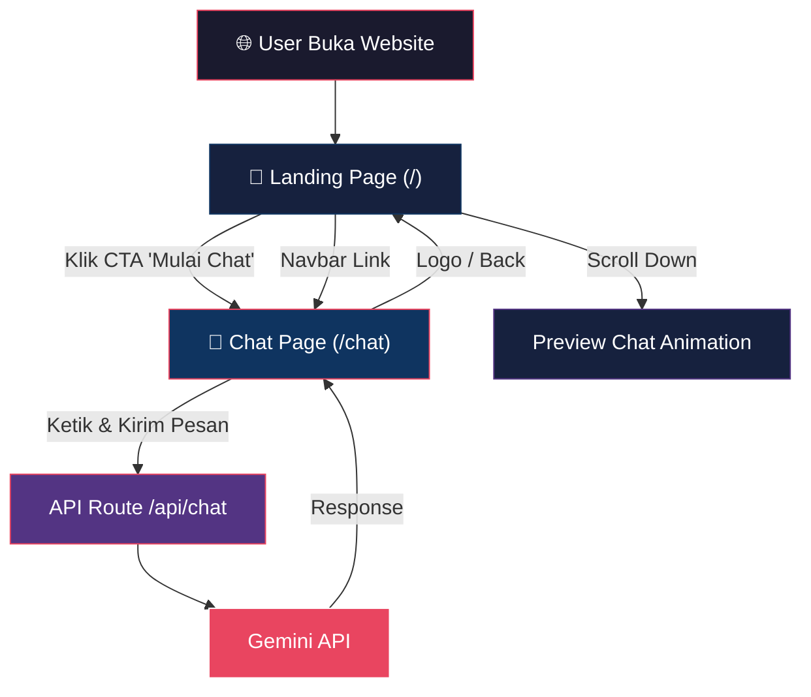
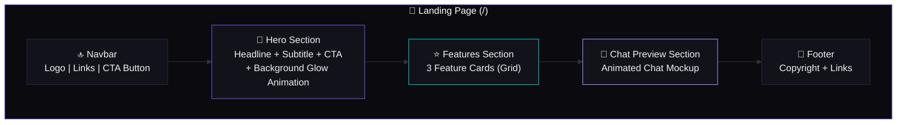
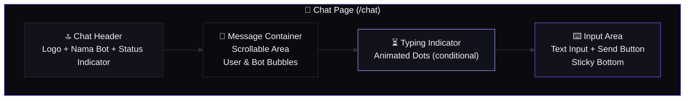
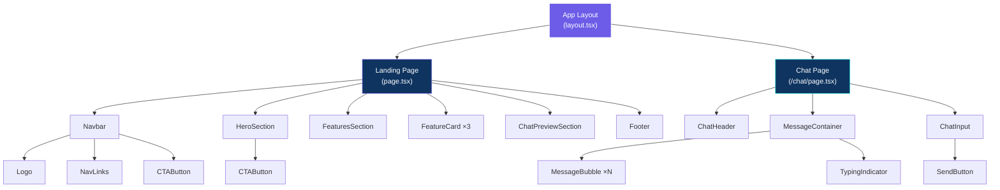
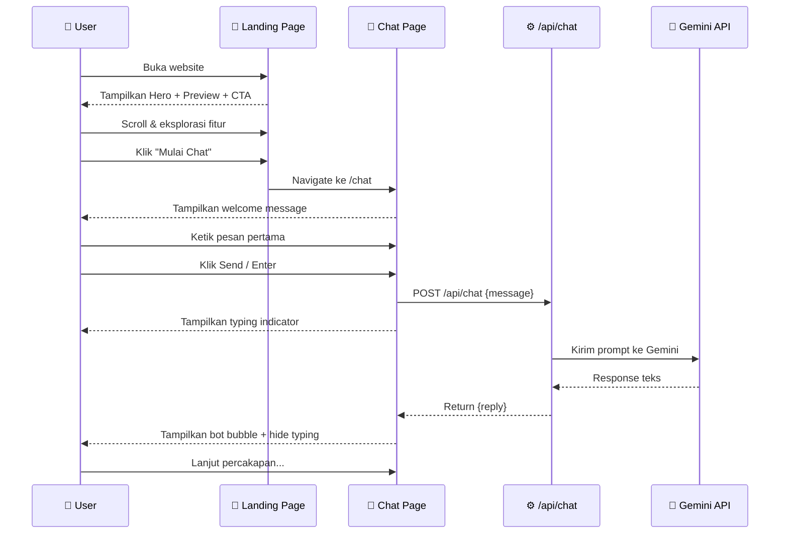
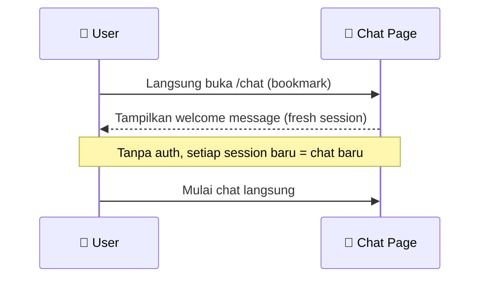
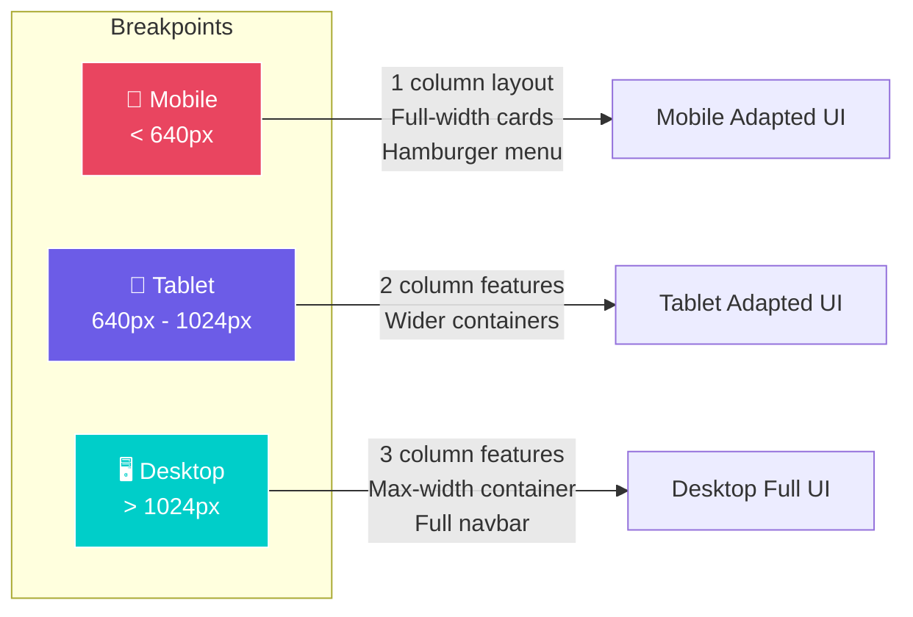

# 🎨 Frontend Implementation Plan — ChatKu AI Chatbot

> **Brand**: ChatKu · **Theme**: Dark Only · **Tailwind**: v3 · **Framework**: Next.js (App Router)

Berdasarkan PRD, aplikasi ini memiliki 2 halaman utama: **Landing Page** (`/`) dan **Chat Page** (`/chat`). Dokumen ini membahas secara detail arsitektur UI/UX, design system, navigasi, dan component breakdown untuk frontend.

---

## 1. Site Map & Navigation Flow



### Navigasi Antar Halaman

| Dari | Ke | Trigger | Metode |
|---|---|---|---|
| Landing Page | Chat Page | Klik CTA "Mulai Chat" | `next/link` atau `router.push('/chat')` |
| Landing Page | Chat Page | Klik "Chat" di Navbar | `next/link` |
| Chat Page | Landing Page | Klik Logo di Header | `next/link` |
| Any Page | Scroll Section | Navbar anchor link | Smooth scroll (`scrollIntoView`) |

---

## 2. Design System

### 2.1 Color Palette

Menggunakan dark-mode-first approach dengan accent warna neon/vibrant untuk kesan modern & techy.

```
Primary Background   : #0a0a0f (Deep Dark)
Secondary Background : #12121a (Card/Surface)
Tertiary Background  : #1a1a28 (Elevated Surface)
Border               : #2a2a3d (Subtle Border)

Accent Primary       : #6c5ce7 (Electric Purple)
Accent Secondary     : #00cec9 (Cyan/Teal)
Accent Gradient      : linear-gradient(135deg, #6c5ce7, #00cec9)

Text Primary         : #f0f0f5 (Almost White)
Text Secondary       : #8888a0 (Muted)
Text Accent          : #a29bfe (Soft Purple)

Success              : #00b894
Error                : #ff6b6b
Warning              : #fdcb6e

User Bubble          : #6c5ce7 (Purple)
Bot Bubble           : #1e1e2e (Dark Surface)
```

### 2.2 Typography

```
Font Family   : "Inter" (Google Fonts) — clean, modern, highly readable
Fallback      : system-ui, -apple-system, sans-serif

Hero Title    : 4rem (64px) / font-weight: 800 / letter-spacing: -0.02em
Hero Subtitle : 1.25rem (20px) / font-weight: 400 / color: text-secondary
Section Title : 2rem (32px) / font-weight: 700
Body          : 1rem (16px) / font-weight: 400 / line-height: 1.6
Chat Text     : 0.9375rem (15px) / font-weight: 400
Caption       : 0.75rem (12px) / font-weight: 500 / color: text-secondary
Button        : 1rem (16px) / font-weight: 600 / letter-spacing: 0.02em
```

### 2.3 Spacing & Sizing

```
Base Unit        : 4px
Container Max    : 1200px (Landing) / 800px (Chat)
Border Radius    : 8px (cards), 12px (buttons), 20px (chat bubbles), 9999px (pill)
Navbar Height    : 64px
Chat Input Area  : 72px
Chat Bubble Gap  : 12px
Section Padding  : 80px vertical (desktop), 48px (mobile)
```

### 2.4 Efek & Shadows

```
Glass Effect     : background: rgba(18, 18, 26, 0.7); backdrop-filter: blur(12px);
Card Shadow      : 0 4px 24px rgba(0, 0, 0, 0.3)
Glow Effect      : 0 0 20px rgba(108, 92, 231, 0.3) (untuk CTA)
Input Focus Ring : 0 0 0 2px rgba(108, 92, 231, 0.5)
```

---

## 3. Page Architecture & Wireframe

### 3.1 Landing Page (`/`) — Layout Structure



**Detail per section:**

#### Navbar
- **Fixed/Sticky** di atas
- Glassmorphism background
- Logo (text-based: **"ChatKu"**)
- Menu links: `Home` · `Features` · `Chat`
- CTA button kecil: "Mulai Chat →"

#### Hero Section
- Full viewport height (`100vh`)
- Centered content
- Headline besar: *"Tanya Apa Saja ke AI"* (atau sejenisnya)
- Subtitle penjelasan singkat
- CTA Button besar dengan glow effect + hover animation
- Background: subtle gradient orbs / animated mesh gradient

#### Features Section (3 Columns)
- 3 feature cards dengan icon, judul, deskripsi:
  1. ⚡ **Cepat & Ringan** — Tanpa login, langsung chat
  2. 🧠 **Powered by Gemini** — AI canggih dari Google
  3. 💬 **Chat Natural** — Percakapan smooth seperti teman

#### Chat Preview Section
- Mockup chat interface dengan animasi
- Bubble chat muncul satu per satu (staggered animation)
- Menunjukkan contoh percakapan user ↔ bot

#### Footer
- Minimalis: copyright, "Built with ❤️", link GitHub (opsional)

---

### 3.2 Chat Page (`/chat`) — Layout Structure



**Detail per section:**

#### Chat Header
- Height: `64px`
- Logo/nama chatbot (klik → kembali ke landing)
- Status indicator: "Online" (hijau dot)
- Opsi: tombol "New Chat" (untuk clear conversation)

#### Message Container
- `flex-grow`, scrollable (`overflow-y: auto`)
- Auto-scroll ke bawah saat pesan baru
- Welcome message saat pertama kali buka (empty state)
- Bubble layout:
  - **User**: rata kanan, warna accent (purple), border-radius kiri
  - **Bot**: rata kiri, warna surface dark, border-radius kanan
  - Timestamp kecil di bawah setiap bubble

#### Typing Indicator
- Muncul saat menunggu response dari API
- 3 animated dots (bouncing)
- Posisi: di bawah bubble terakhir, rata kiri (sebagai "bot sedang mengetik")

#### Input Area
- **Sticky bottom** (`position: sticky; bottom: 0`)
- Text input dengan border glow on focus
- Send button (icon arrow ↑) — disabled saat input kosong
- Support `Enter` to send, `Shift+Enter` for newline

---

## 4. Component Hierarchy



### Component List & Responsibilities

| Component | File Path | Deskripsi |
|---|---|---|
| `RootLayout` | `app/layout.tsx` | Font loading, global styles, metadata |
| **Landing Page** | `app/page.tsx` | Compose semua section landing |
| `Navbar` | `components/Navbar.tsx` | Navigasi sticky + glassmorphism |
| `HeroSection` | `components/HeroSection.tsx` | Hero content + CTA + bg animation |
| `FeaturesSection` | `components/FeaturesSection.tsx` | Grid 3 feature cards |
| `FeatureCard` | `components/FeatureCard.tsx` | Reusable card (icon, title, desc) |
| `ChatPreviewSection` | `components/ChatPreviewSection.tsx` | Animated chat mockup |
| `Footer` | `components/Footer.tsx` | Footer minimalis |
| **Chat Page** | `app/chat/page.tsx` | Compose chat interface |
| `ChatHeader` | `components/chat/ChatHeader.tsx` | Header + status + back link |
| `MessageContainer` | `components/chat/MessageContainer.tsx` | Scrollable message area |
| `MessageBubble` | `components/chat/MessageBubble.tsx` | Single chat bubble (user/bot) |
| `TypingIndicator` | `components/chat/TypingIndicator.tsx` | Animated "..." dots |
| `ChatInput` | `components/chat/ChatInput.tsx` | Sticky input + send button |
| `CTAButton` | `components/ui/CTAButton.tsx` | Reusable CTA button + glow |

---

## 5. User Interaction Flow

### 5.1 First-Time User Flow



### 5.2 Returning User Flow



---

## 6. Responsive Design Strategy



### Detail Responsive Per Component

| Component | Mobile (< 640px) | Tablet (640-1024px) | Desktop (> 1024px) |
|---|---|---|---|
| **Navbar** | Hamburger menu, logo only | Logo + CTA | Full links + CTA |
| **Hero** | `text-3xl`, stack layout | `text-4xl` | `text-6xl`, padding besar |
| **Features** | 1 column stack | 2 columns grid | 3 columns grid |
| **Chat Preview** | Hidden or simplified | Scaled down | Full mockup |
| **Chat Page** | Full screen, no padding | Centered with padding | Max-width 800px |
| **Chat Input** | Full width, bigger touch target | Same | Same |
| **Message Bubble** | Max-width 90% | Max-width 75% | Max-width 65% |

---

## 7. Animation & Micro-Interaction Spec

Semua animasi menggunakan **Framer Motion**.

### Landing Page Animations

| Element | Animation | Trigger | Duration |
|---|---|---|---|
| Navbar | Fade in + slide down | Page load | 0.5s, ease-out |
| Hero Title | Fade in + slide up | Page load | 0.8s, delay 0.2s |
| Hero Subtitle | Fade in + slide up | Page load | 0.8s, delay 0.4s |
| CTA Button | Scale in + glow pulse | Page load | 0.6s, delay 0.6s |
| CTA Hover | Scale(1.05) + shadow expand | Hover | 0.2s |
| Feature Cards | Fade in + slide up (stagger) | Scroll into view | 0.5s each, stagger 0.15s |
| Chat Preview Bubbles | Fade in + slide in (stagger) | Scroll into view | 0.4s each, stagger 0.8s |
| Background Orbs | Slow float/drift | Continuous | 15-20s loop |

### Chat Page Animations

| Element | Animation | Trigger | Duration |
|---|---|---|---|
| New Message (User) | Slide in from right + fade | Send message | 0.3s, ease-out |
| New Message (Bot) | Slide in from left + fade | Receive response | 0.3s, ease-out |
| Typing Indicator | 3 dots bounce (stagger) | Waiting response | Loop, 0.4s per dot |
| Send Button | Scale(0.95) on press | Click | 0.1s |
| Input Focus | Border glow + expand ring | Focus | 0.2s |
| Welcome Message | Fade in + scale | Page load | 0.5s |

---

## 8. Empty / Edge States

| State | UI Behavior |
|---|---|
| **First Load (No Messages)** | Welcome message: "Halo! 👋 Aku AI assistant. Tanya apa saja!" + suggestion chips |
| **Waiting Response** | Typing indicator dots + input disabled |
| **API Error** | Error bubble merah: "Maaf, terjadi kesalahan. Coba lagi." + retry button |
| **Empty Input** | Send button disabled (greyed out) |
| **Very Long Message** | Text wrapping + bubble max-width constraint |
| **Rate Limited** | Toast notification: "Terlalu banyak request. Tunggu sebentar." |

---

## 9. Folder Structure (Frontend)

```
e:\Coding\chatbot\
├── app/
│   ├── layout.tsx              # Root layout (font, metadata, global)
│   ├── page.tsx                # Landing Page
│   ├── globals.css             # Global styles + design tokens
│   └── chat/
│       └── page.tsx            # Chat Page
├── components/
│   ├── Navbar.tsx
│   ├── HeroSection.tsx
│   ├── FeaturesSection.tsx
│   ├── FeatureCard.tsx
│   ├── ChatPreviewSection.tsx
│   ├── Footer.tsx
│   ├── chat/
│   │   ├── ChatHeader.tsx
│   │   ├── MessageContainer.tsx
│   │   ├── MessageBubble.tsx
│   │   ├── TypingIndicator.tsx
│   │   └── ChatInput.tsx
│   └── ui/
│       └── CTAButton.tsx
├── hooks/
│   └── useChat.ts              # Custom hook: manage chat state & API calls
├── lib/
│   └── gemini.ts               # Gemini API helper (for API route)
├── types/
│   └── chat.ts                 # TypeScript types (Message, etc.)
├── public/
│   └── ...                     # Static assets
├── tailwind.config.ts
├── next.config.ts
└── package.json
```

---

## 10. Phased Execution Plan (Frontend Only)

### Phase 1A — Setup & Foundation
- [x] Baca & analisis PRD ✅
- [ ] Init Next.js project (App Router, TypeScript)
- [ ] Install dependencies: `tailwindcss`, `framer-motion`
- [ ] Setup `globals.css` dengan design tokens (colors, typography, spacing)
- [ ] Setup `tailwind.config.ts` extend theme dengan design system
- [ ] Setup Google Font "Inter" di `layout.tsx`
- [ ] Setup root layout dengan metadata SEO

### Phase 1B — Landing Page
- [ ] Build `Navbar` component (sticky, glassmorphism, responsive)
- [ ] Build `HeroSection` (headline, subtitle, CTA, bg animation)
- [ ] Build `CTAButton` reusable component
- [ ] Build `FeaturesSection` + `FeatureCard` (3 cards grid)
- [ ] Build `ChatPreviewSection` (animated mockup)
- [ ] Build `Footer`
- [ ] Assemble Landing Page (`app/page.tsx`)
- [ ] Add scroll animations (Framer Motion `whileInView`)
- [ ] Responsive testing semua breakpoint

### Phase 1C — Chat Page UI
- [ ] Build `ChatHeader` (logo, status, back nav)
- [ ] Build `MessageBubble` (user vs bot style)
- [ ] Build `MessageContainer` (scrollable, auto-scroll)
- [ ] Build `TypingIndicator` (animated dots)
- [ ] Build `ChatInput` (sticky bottom, enter to send)
- [ ] Build `useChat` hook (state management: messages, loading, send)
- [ ] Assemble Chat Page (`app/chat/page.tsx`)
- [ ] Add chat animations (bubble entrance, typing indicator)
- [ ] Handle empty/error states
- [ ] Responsive testing semua breakpoint

### Phase 1D — Polish & QA
- [ ] Cross-browser testing
- [ ] Performance audit (Lighthouse)
- [ ] Accessibility check (keyboard nav, contrast, aria labels)
- [ ] Final responsive QA

---

## Decisions (Resolved)

| Decision | Choice |
|---|---|
| Brand Name | **ChatKu** |
| Theme | **Dark Only** |
| Tailwind Version | **v3** (stable & mature) |
| Framework | Next.js App Router + TypeScript |

## Verification Plan

### Automated Tests
- `npm run build` — pastikan build sukses tanpa error
- Lighthouse audit via browser DevTools (target: Performance > 90, Accessibility > 90)

### Manual Verification
- Visual QA di browser: Chrome, Firefox, Safari
- Responsive check: 375px (mobile), 768px (tablet), 1440px (desktop)
- Test semua navigation links dan CTA buttons
- Test chat UI interactions (send, empty state, loading state)
- Test keyboard navigation dan focus management
